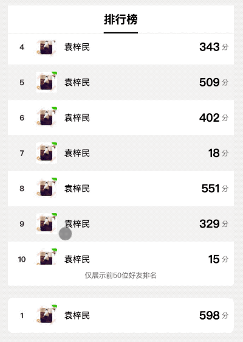

# minigame-canvas-engine

[](https://badge.fury.io/js/minigame-canvas-engine)
[](https://travis-ci.org/wechat-miniprogram/minigame-canvas-engine)
[](https://coveralls.io/github/wechat-miniprogram/minigame-canvas-engine?branch=master)
[](https://github.com/yuanzm/opendatacontextenginetest)

## 简介
对小游戏游戏开发而言，开放数据域开发一直存在引入游戏引擎导致代码包体积偏大和利用canvas原生开发绘制界面麻烦的矛盾。其实对于大部分小游戏而言，开放数据域仅仅需要绘制一个可滚动的游戏列表和添加一些简单的点击交互，这和常见的Web开发非常相似。本项目旨在引入一段相对游戏引擎而言体积非常小的通用库后以Web开发的方式开发canvas界面，因此，本项目仅支持简单的UI绘制，不会支持动画等功能。

对于Web开发而言，开发者仅需要编写HTML+CSS，浏览器会理解这些代码并渲染出开发者需要的界面。对于canvas开发而言，仅有一系列很原子的API，开发者需要自己合理组织API的时序来完成布局。如果想让canvas开发类Web开发，我们在采用HTML+CSS或者类HTML+类CSS开发的时候，需要有一个简单的渲染引擎能够解析和渲染到canvas上面。

对于上述问题，最麻烦的是计算一颗树的布局，得出每个元素的位置和尺寸属性，幸运的是，早已有人造出这样的[轮子](https://www.npmjs.com/package/css-layout)，乍一看觉得这库没什么用，实际上非常契合canvas的场景：没有DOM，纯JavaScript实现CSS的子集，包括flexbox和box模型。当最麻烦的布局解决之后，就需要将每个元素按照canvas的API将borderColor、textAlign、color等属性表达出来，本项目应运而生。

## web端调试
为了方便UI调试，可以在线编辑预览效果: [Playground](https://wechat-miniprogram.github.io/minigame-canvas-engine/)

## 效果预览


## 更新日志
详见[CHANGELOG.md](CHANGELOG.md)

## 安装使用

 1. 克隆本项目到合适的文件夹或者通过npm安装（参考[小程序npm支持](https://developers.weixin.qq.com/miniprogram/dev/devtools/npm.html))
 ```
    // git安装方式
    git clone https://github.com/wechat-miniprogram/minigame-canvas-engine
    // npm安装方式
    npm install  --save minigame-canvas-engine
 ```

 2. 引用渲染引擎：
 ```
 import Layout from 'minigame-canvas-engine'
 ```

 3. 编写模板字符串：这里采用XML去描述界面，而且支持有限的标签。需要特别注意的是，模板字符串只能有一个根节点，第二个节点会被忽略。如果想让模板更加强大，可以借助第三方模板引擎如[dot.js](https://olado.github.io/doT/index.html)。

 ```
    let template = `
     <view id="container">
        <text id="testText" class="redText" value="hello canvas">
     </view>
    `
 ```

 4. 编写样式：样式为一个style对象，与Web开发不同的是，不受属性前后顺序的影响，class的属性会覆盖id的同名属性。tips: 由于采用了第三方的布局引擎css-layout，在编写样式的时候为所有元素都设置好width和height属性会更容易得到想要的效果，其中**根节点**必须设置width和height属性。

 ```
    let style = {
        container: {
            width: 200,
            height: 100,
            backgroundColor: '#ffffff',
            justContent: 'center',
            alignItems: 'center',
        },
        testText: {
            color: '#ffffff',
            width: 200,
            height: 50,
            lineHeight: 50,
            fontSize: 20,
            textAlign: 'center',
        },
        // 文字的最终颜色为#ff0000
        redText: {
            color: '#ff0000',
        }
    }
 }
 ```
 5. 初始化渲染引擎：将第二第三步编写的模板和样式传给渲染引擎，渲染引擎会生成布局树和渲染树等，准备渲染到canvas上面。

 ```
    Layout.init(template, style);
 ```

 6. 执行渲染：指定被渲染的context，绘制UI
 ```
 // sharedContext自行创建
 Layout.layout(sharedContext);
 ```
 7. 如果本渲染引擎在子域中使用，需要设置主域的渲染信息：
 ```
 // 设置sharedCancas在主域绘制的物理尺寸和位置信息，这一步非常重要，因为子域渲染引擎并不关心外部使用的引擎是什么，而是自己监听触摸事件来进行事件处理，因此需要拿到真实的物理尺寸、位置信息来执行事件处理。
  Layout.updateViewPort({
        width : 200,
        height: 100,
        x     : 100,
        y     : 100
  });
 ```

## **API**

### **LayoutAPI**

#### 1. Layout.getElementsById(String elementId)
获取元素id为**elementId**的一组元素

#### 2. Layout.getElementsByClassName(String className)
获取包含class为**className**的一组元素

#### 3. Layout.clear()
清理画布，之前的计算出来的渲染树也会一并清理，此时可以再次执行init和layout方法渲染界面。

#### 4. Layout.clearPool()
调用此API可以清理对象池，释放内存

#### 5. Layout.clearAll()
等价于按序调用Layout.clear和Layout.clearPool.

#### 6. Layout.loadImgs(Array imgarr)
对于图片资源，如果不提前加载，渲染过程中可能出现挨个出现图片效果，影响体验。通过Layout.loadImgs可以预加载图片资源，在调用Layout.layout的时候渲染性能更好，体验更佳。
```
// 注意图片路径不需要加./作为前缀，以小游戏根目录作为根目录
Layout.loadImgs([
    'sub/Buffet_icon_GiftPlate_0.png',
    'sub/Buffet_icon_GiftPlate.png',
    'sub/UI_Icon_Rating.png',
]);

```

### **事件API**
通过getElementsById或者getElementsByClassName获取元素之后，可以的绑定事件，支持的事件有`touchstart`、`touchmove`、`touchend`、`touchcancel`、`click`,示例如下：
```
const list = Layout.getElementsByClassName('listItem');

list.forEach(item => {
    item.on('touchstart', (e) => {
        console.log(e, item);
    });
});
```

### **属性API**
通过Layout.getElementsById和Layout.getElementsByClassName获取image和text之后，修改图片的链接或者文本的值会自动重渲染界面。
```
let img = Layout.getElementsById('testimgid')[0];
img.src = 'newimgsrc';

let text = Layout.getElementsById('tesettextid')[0];
text.value = 'newtextvalue';
```

### **标签**

#### 标签列表

|      标签      |            说明          |
|----------------|----------------             |
| view           | 容器标签，与HTML中的div相似 |
| scrollview           | 滚动列表容器，如果容器内的子元素高度大于scrollview高度，支持纵向滚动，不支持嵌套scrollview |
| image           | 图片标签，注意图片路径不需要加./作为前缀，以小游戏根目录作为根目录 |
| text           | 文本标签 |

#### 标签属性
|      属性      |  类型  | 是否必填 |          说明          |
|----------------|--------|--------|------------------------|
| id  | string |    否 | 非唯一标识，两个标签可以共用id
| class | string |    否    | 与浏览器相同 |
| value     | string |   否     | text标签支持 |
| src      | string |   否    | image标签才支持 |

### **样式**
**布局**

| 属性名                | 支持的值或类型                                            | 默认值     |
| --------------------- | --------------------------------------------------------- | ---------- |
| width                 | number                                                    | 0          |
| height                | number                                                    | 0          |
| position              | relative, absolute                                        | relative   |
| left                  | number                                                    | 0          |
| top                   | number                                                    | 0          |
| right                 | number                                                    | 0          |
| bottom                | number                                                    | 0          |
| margin                | number                                                    | 0          |
| marginLeft            | number                                                    | 0          |
| marginRight           | number                                                    | 0          |
| marginTop             | number                                                    | 0          |
| marginBottom          | number                                                    | 0          |
| padding               | number                                                    | 0          |
| paddingLeft           | number                                                    | 0          |
| paddingRight          | number                                                    | 0          |
| paddingTop            | number                                                    | 0          |
| paddingBottom         | number                                                    | 0          |
| borderWidth           | number                                                    | 0          |
| borderRadius          | number                                                    | 0          |
| flexDirection         | column, row                                               | row        |
| flexShrink            | number                                                    | 1          |
| flexGrow              | number                                                    |            |
| flexWrap              | wrap, nowrap                                              | nowrap     |
| justifyContent        | flex-start, center, flex-end, space-between, space-around | flex-start |
| alignItems, alignSelf | flex-start, center, flex-end, stretch                     | flex-start |

**文本**

| 属性名          | 支持的值或类型      | 默认值      |
| --------------- | ------------------- | ----------- |
| fontSize        | number              | 14          |
| lineHeight      | number / string     | '1.4em'     |
| textAlign       | left, center, right | left        |
| verticalAlign   | top, middle, bottom | top         |
| color           | string              | #000000     |
| backgroundColor | string              | transparent |

**容器**

|      属性     |  类型  | 默认值 |           说明           |
|---------------|--------|--------|--------------------------|
| backgroundColor       | string |        | 背景的颜色，支持 6 位 16 进制、8 位 16 进制、rgb、rgba 四种格式的颜色                   |


**边框**

| 属性 | 类型 | 默认值 | 说明 |
|---------------|--------|--------|--------------------------|
| borderRadius | number | | 边框圆角 |
| borderColor | string |  | 边框颜色，支持 6 位 16 进制、8 位 16 进制、rgb、rgba 四种格式的颜色 |

